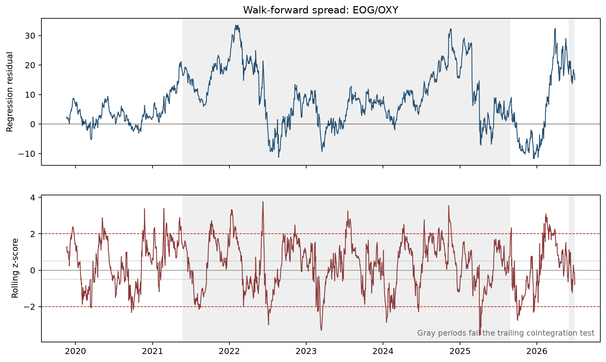
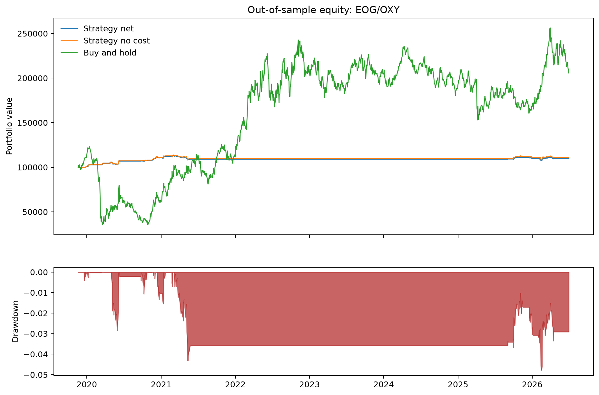
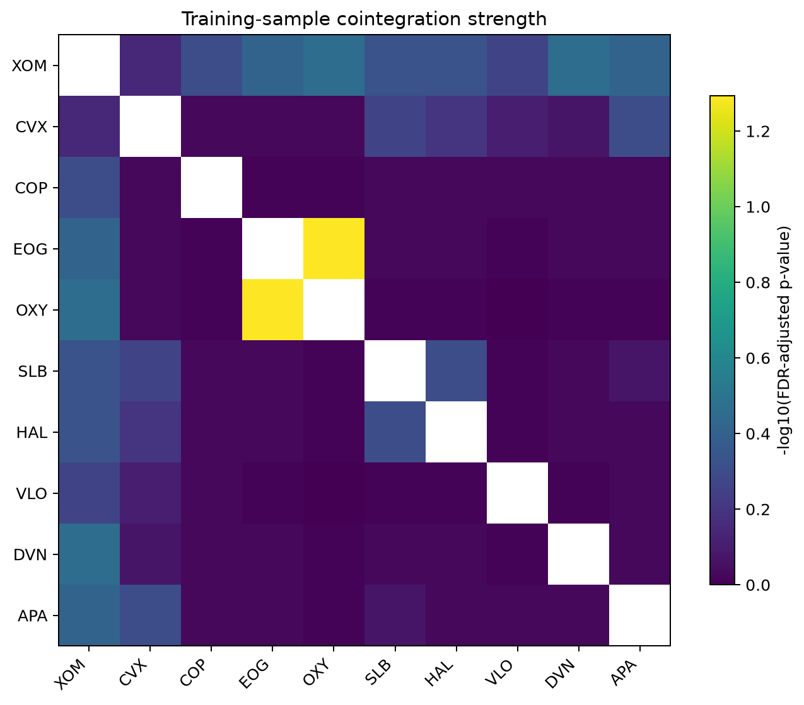

# Pairs Trading Research Project

This project tests a simple trading idea using two energy stocks: when their usual price relationship moves far apart, trade on the chance that it moves back together.

The project is designed as a small, reproducible research project rather than a claim that the strategy is ready to trade with real money.

## What it does

- Reviews a group of energy stocks to find a pair with a stable historical relationship.
- Uses EOG and OXY as the selected pair.
- Opens a trade when the relationship moves unusually far from its recent range.
- Closes the trade when the relationship moves closer to normal.
- Uses smaller positions when the pair has been more volatile.
- Includes commissions, trading slippage, and a cost for borrowing the short position.
- Rechecks the relationship over time and pauses trading when the evidence no longer supports it.

The study uses daily adjusted prices from January 2010 through June 2026. Pair selection uses only earlier data; results are then measured on later data. This helps avoid judging the idea with information that would not have been available at the time.

## Results at a glance

The walk-forward version produced a positive return with a modest drawdown in the later test period. More importantly, it stopped trading through a long period when the EOG/OXY relationship no longer appeared reliable. That behavior is a central part of the project: a signal is only useful while its underlying relationship still holds.

The strategy had a lower return than simply owning the two stocks, but it also took much less risk. The results should be read as a research finding, not an investment recommendation.

## Charts

### Pair relationship and trading signals

Gray areas show periods when the pair did not pass the rolling relationship check, so the strategy stayed out of the market.



### Strategy value and drawdown

This chart compares the strategy after costs, the same strategy before costs, and a simple buy-and-hold comparison.



### Pair selection

This chart summarizes which energy-stock pairs had the strongest historical relationships during the selection period.



## Run it

Install the project requirements, then run:

```powershell
python scripts/run_analysis.py
```

The script downloads the required price data and writes charts and result summaries to `outputs/`.

## Project layout

- `src/` contains the reusable research and backtesting code.
- `scripts/` contains the command that runs the full analysis.
- `tests/` contains checks for core trading logic and data handling.
- `outputs/` contains the generated charts and summaries.

## Important limitations

- The project uses freely available daily data, not live market data.
- Trading costs are reasonable assumptions, not broker quotes.
- A two-stock strategy can fail when the companies or the energy market change.
- The project does not guarantee future returns.
